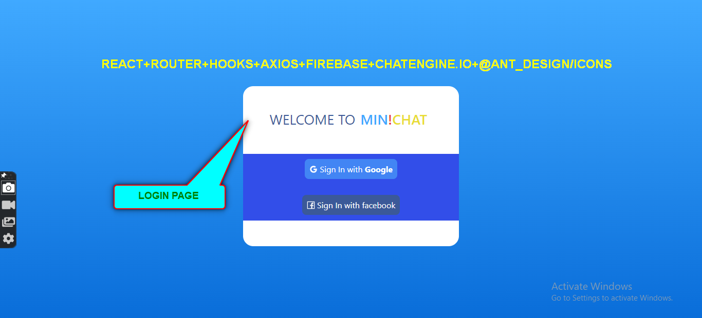
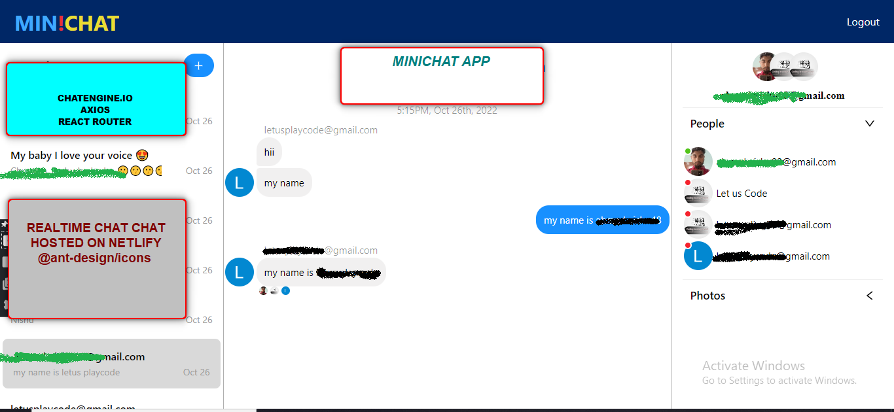
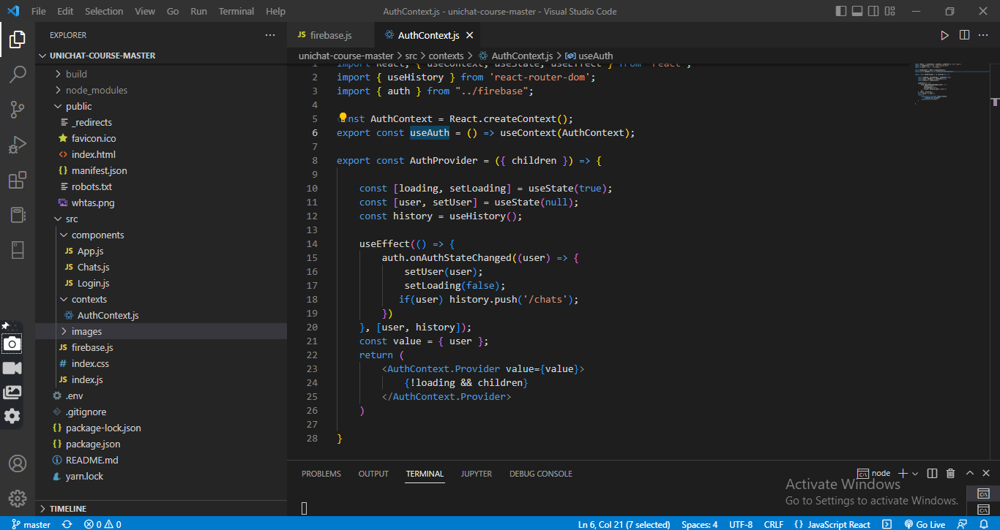

# Minichat Application
# LoginUI

# Chat page

# File Structure

## Introduction

This is a minichat app for the real time chat hosted on netlify. In this app, we can  Realtime Chat and  with Social Auth and dedicated chat APIs/sockets.

You will learn how to build a react chat app using [https://chatengine.io](https://chatengine.io)

Firebase and Chat Engine are greats tools to setup apps fast and easily - great to learn with!

### features
- Easy UI
- Tap to add user via email left side-bar
- Select user to chat at right side-bar
- Mobile friendly
- Run on any devices

### Dependencies
- Desinge purpose
- - @ant-design/icons
- Api call 
- - Axios
- For entire chat application
- - React chat-engine

- React Router –Dom
- - It is a library that allows you to have multi-page application using react
here imported Browser router as switch component and the route components
import { BrowserRouter as Router, Switch, Route } from "react-router-dom"

## Hosted link
![https://minichatfahad.netlify.app/]

